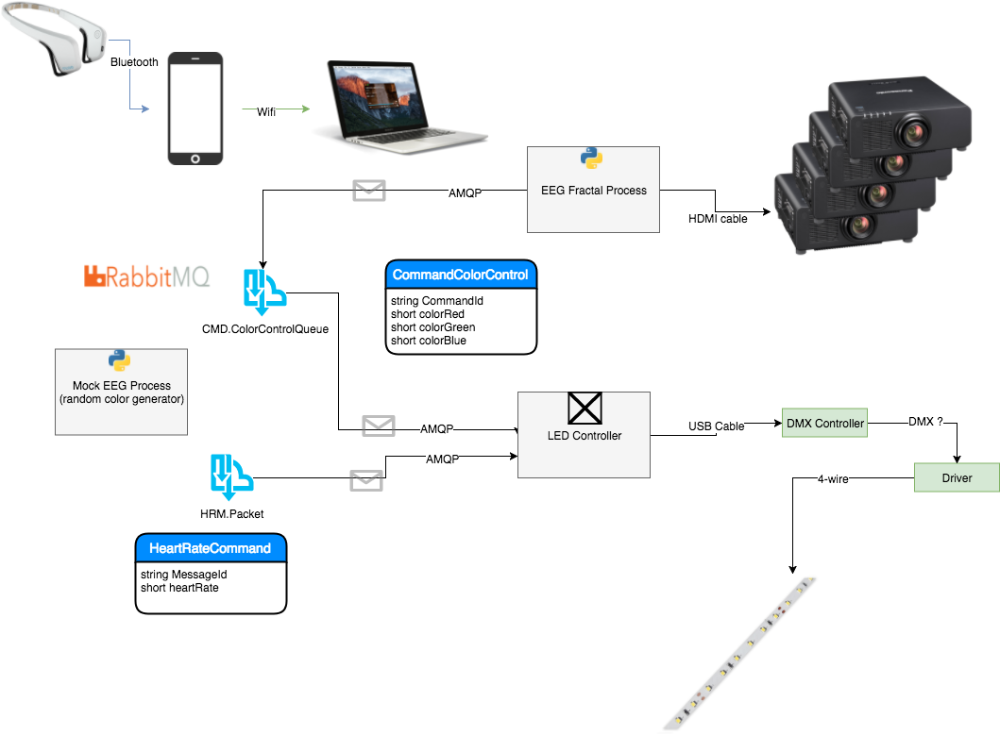

# MindMurmur.Lights
## LED Light strip controller 

### Overview

## C#

## Python
Since python is currently being utilized to process all EEG data along with heart rate data, RabbitMQ provides the decoupled integration for the LED controller and python.  Example code has been included with additional information [here](python/HeartRatePublisher/README.md).

- - - -

### Installation

- - - -
